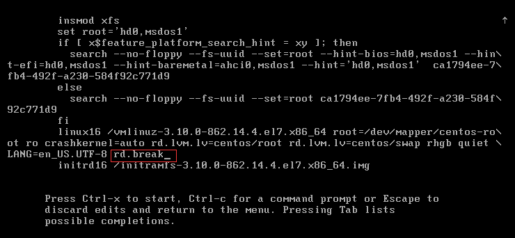
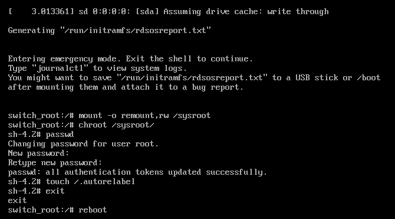

# CentOS 7.5 reset root user password

忘记root密码，重新设置root密码

开机时选择主版本的内核，然后按e键进入编辑模式 </br>


修改如图选项：

- 添加：`rd.break`



然后按`Ctrl+X`进入单用户模式</br>
输入以下命令：

```shell
mount -o remount,rw /sysroot   # 重新挂在root分区
chroot /sysroot                # 进入root分区
passwd                         # 修改root密码
touch /.autorelabel            # 更新SELinux信息
exit                           # 推出chroot
reboot                         # 重启系统
```

如图：</br>

