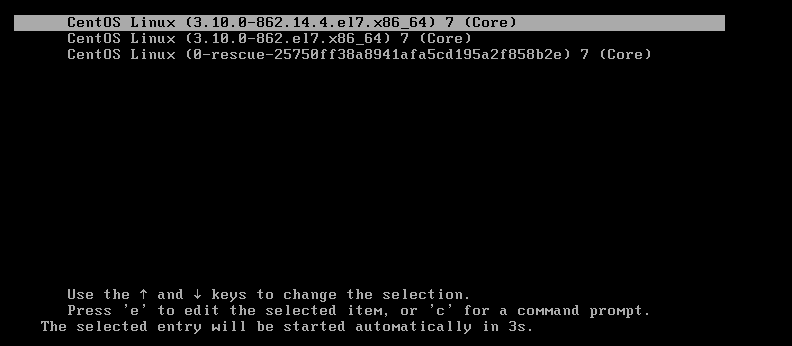
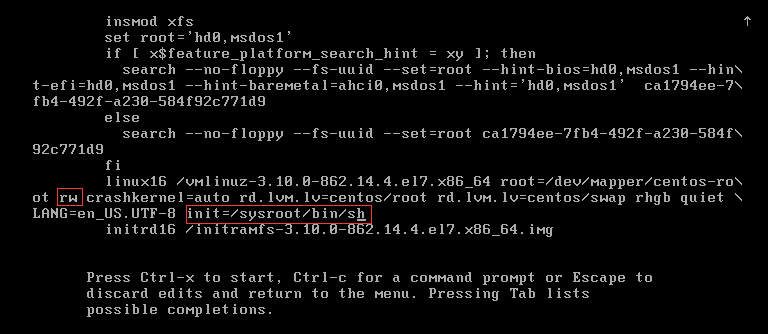
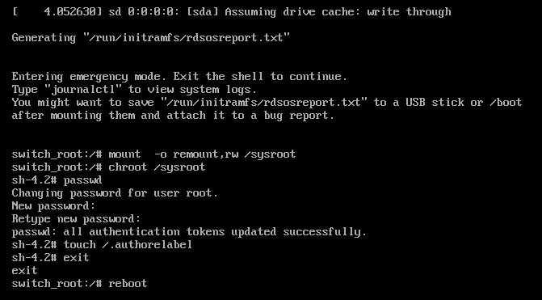

# CentOS 7.5 reset root password

忘记root密码，重新设置root密码

开机时选择主版本的内核，然后按e键进入编辑模式 </br>


修改如图选项：

- ro ===> rw
- 添加：`init=/sysroot/bin/sh`



然后按`Ctrl+X`进入单用户模式</br>
输入一下命令：

```shell
chroot /sysroot
passwd root
touch /.autorelabel
```

重启:

```shell
exit
reboot
```

如图：</br>
